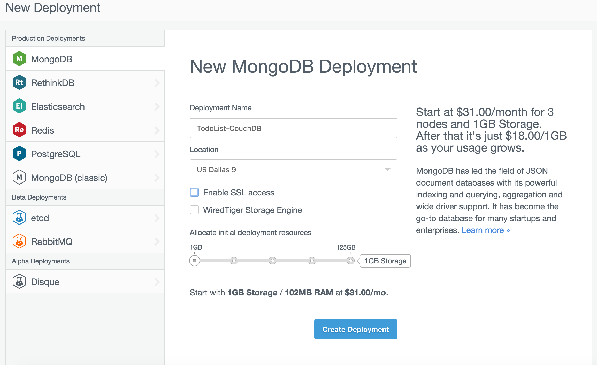
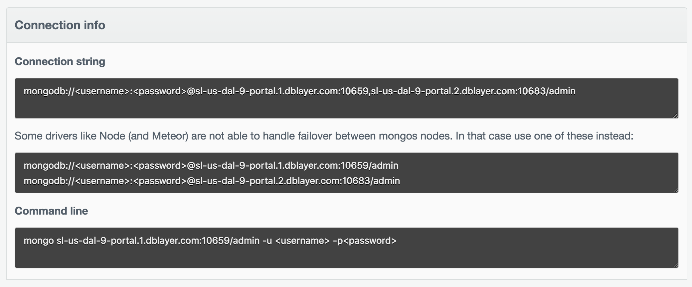
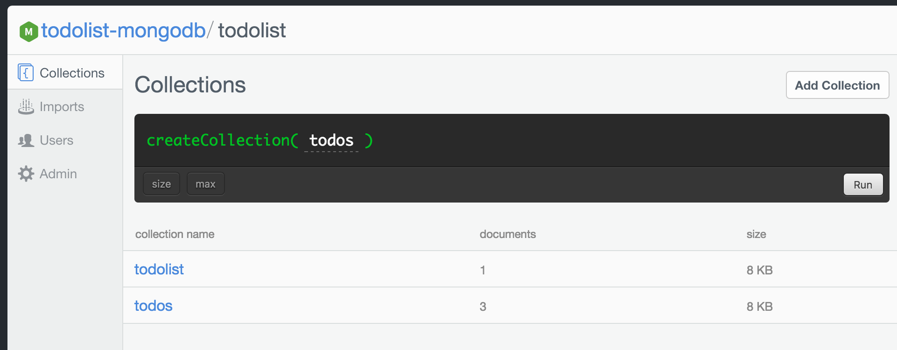
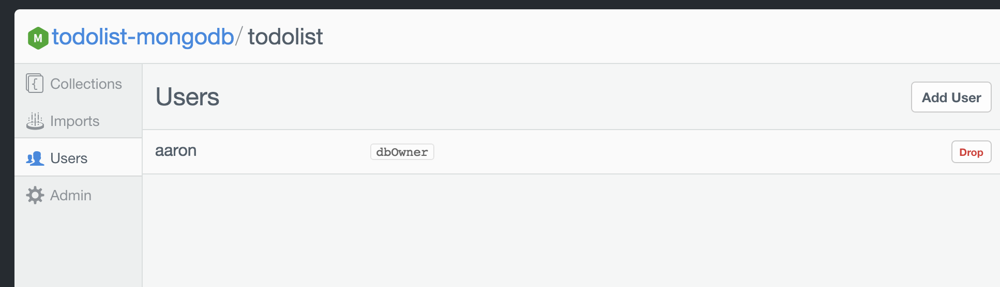
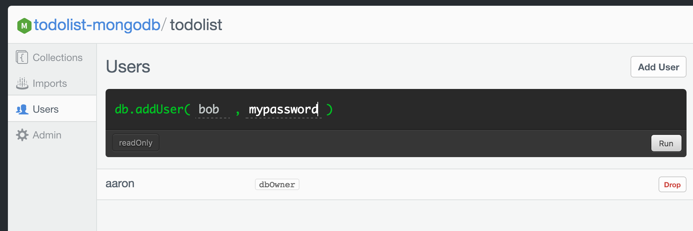
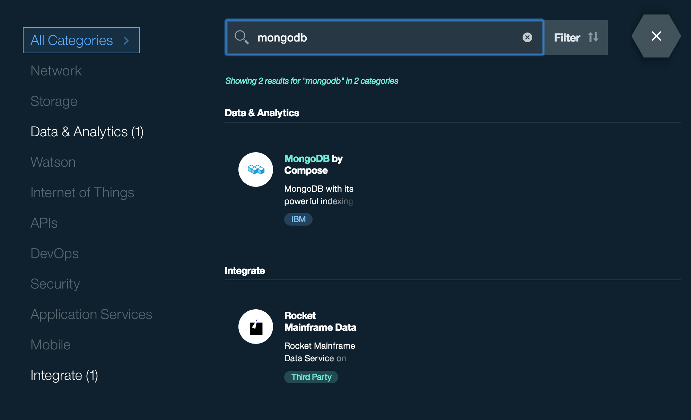
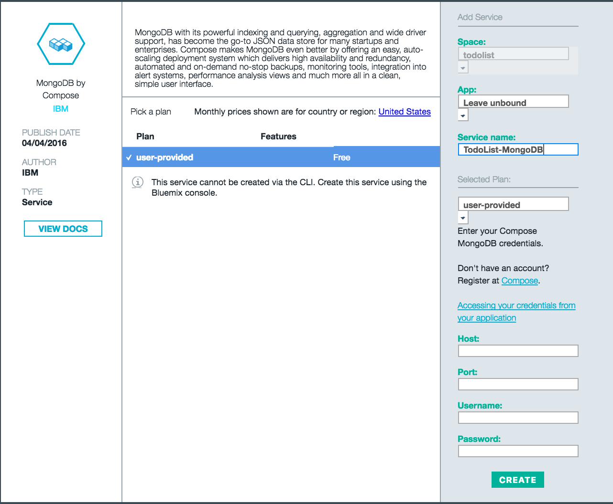
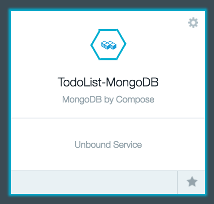

# Todolist MongoDB

Todolist implemented for MongoDB backend

[](https://travis-ci.org/IBM-Swift/TodoList-MongoDB)
[](https://swift.org/download/#snapshots)
### Initial Setup:

- Download XCode 8 on macOS or the latest linux [Swift 3.0 Release](https://swift.org/download/#releases)

- Download MongoDB
  
  - macOS
  ```
    $ brew install mongodb
    ```
  - linux
  ```
    $ sude apt-get mongodb
    ```
  If you are using mongodb for the first time, create the directory to which the mongod process will write data
  ```
  mkdir -p /data/db
  mkdir -p ~/log
  ```

  More information can be found [here](https://docs.mongodb.com/manual/tutorial/install-mongodb-on-os-x/)

  Additionally, you can view the database' shell with `$ mongo`

- Clone the TodoList-mongodb repository


### Running Locally:

1. You can start your database by running `mongod`

2. Build the project and run it
    - macOS
  ```
    swift build
    ./build/debug/TodoList
    ```
  - linux
  ```
    swift build -Xcc -fblocks -Xlinker -rpath -Xlinker .build/debug 
    ./build/debug/TodoList
    ```
3. Open the [TodoList Client](http://www.todobackend.com/client/index.html?http://localhost:8090) and enjoy!

## Deploying to Bluemix

### Deploy to Bluemix Button

You can use this button to deploy ToDo your Bluemix account, all from the browser. The button will create the application, create and bind any services specified in the manifest.yml file and deploy.

[](https://bluemix.net/deploy?repository=https://github.com/IBM-Swift/TodoList-MongoDB#bluemix-mongo)

### Manually

Bluemix is a hosting platform from IBM that makes it easy to deploy your app to the cloud. Bluemix also provides various popular databases. Compose for MongoDB is an offering that is compatible with the MongoDB database. You can use Compose for MongoDB with your deployed TodoList-MongoDB application.

1. Get an account for [Bluemix](https://console.ng.bluemix.net/registration/)

2. Download and install the [Cloud Foundry tools](https://new-console.ng.bluemix.net/docs/starters/install_cli.html):

    ```
    cf api https://api.ng.bluemix.net
    cf login
    ```

    Be sure to run this in the directory where the manifest.yml file is located.

2. Create your MongoDB Service

  ```
  cf create-service compose-for-mongodb Standard TodoList-MongoDB
  ```

3. Run `cf push`   

    ***Note** This step will take 3-5 minutes

    ```
    1 of 1 instances running 

    App started
    ```

4. Get the credential information

   ```
   cf env TodoListMongoDBApp
   ```
   
   Note you will see something similar to the following, note the hostname, username, and password:
   
   ```json
"VCAP_SERVICES": {
	"compose-for-mongodb": [{
		"credentials": {
			"ca_certificate_base64": "<base64-string>",
			"db_type": "mongodb",
			"deployment_id": "5849981b78ae6b0013000027",
			"name": "bmix_dal_yp_eaf81143_0baa_4166_ab8e_21bef291190b",
			"uri": "mongodb://<username>:<password>@bluemix-sandbox-dal-9-portal.5.dblayer.com:19889,bluemix-sandbox-dal-9-portal.4.dblayer.com:19889/admin?ssl=true",
			"uri_cli": "mongo --ssl --sslAllowInvalidCertificates bluemix-sandbox-dal-9-portal.5.dblayer.com:19889/admin -u <username> -p <password>"
		},
		"label": "compose-for-mongodb",
		"name": "TodoList-MongoDB",
		"plan": "Standard",
		"provider": null,
		"syslog_drain_url": null,
		"tags": [
			"big_data",
			"data_management",
			"ibm_created"
		]
	}]
}
 ```
5. Setup your database

use todolist
db.createCollection("todolist")
db.createCollection("todos")
show dbs


### Setting up MongoDB by Compose ###

1. Get an account for [Compose](https://www.compose.com/mongodb/)

2. Navigate to deployment section on the side bar. Select MongoDB and set your deployment name, location, and disable SSL access

    

3. Create Deployment and you should see a field for your connection info.

    

4. Setup a new database called `todolist`

5. Setup a collection with `todolist` called `todos`

    

5. Add a new user to the `todolist` database

    

    

Now, you can access your Mongo Database with the given host and port or connect it to bluemix

### Deploying To Bluemix:

1. Get an account for [Bluemix](https://new-console.ng.bluemix.net/?direct=classic)

    #### Setup the MongoDB Service

2. If you haven't already, setup MongoDB by Compose described in the section above

3. Select the MongoDB by Compose Service

    

4. Set the Service name as `TodoList-MongoDB` then initialize the Host, Port, Username, and Password to the values instantiated in the above section

    

5. Upon creation, you should see your unbound service on the dashboard page

    <center></center>

    #### Next Steps: Push to Bluemix

6. Download and install the [Cloud Foundry tools](https://new-console.ng.bluemix.net/docs/starters/install_cli.html):
```
cf login
bluemix api https://api.ng.bluemix.net
bluemix login -u username -o org_name -s space_name
```

    Be sure to change the directory to the todolist-mongodb directory where the manifest.yml file is located.

7. Run `cf push`

    #### Note: The uploading droplet stage should take a long time, roughly 4-6 minutes. If it worked correctly, it should say:
```
2 of 2 instances running
App started
```


### Testing:

- Run the test cases from within your local repository
```
$ git clone https://github.com/IBM-Swift/todolist-tests Tests
$ swift test
```

- Alternatively, checkout the specs on [TodoList-Backend](http://www.todobackend.com/specs/index.html?http://localhost:8090) and set the appropriate url to test

## License

This library is licensed under Apache 2.0. Full license text is available in [LICENSE](LICENSE).
